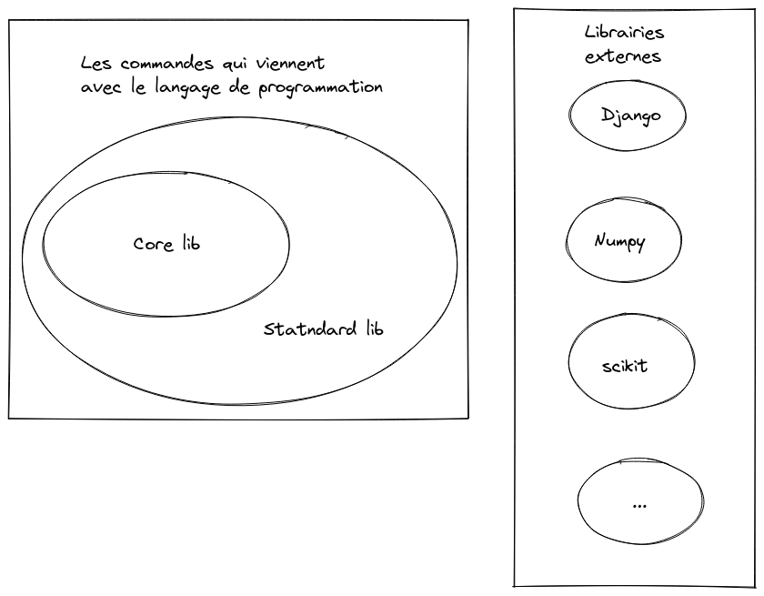

## Personnes présentes

- Andy
- Georges
- Amal
- Yannick

## Les trucs que l'on pourrait faire 

- (python) Avoir un programme pour générer le début du journal
  - question sur les personnes présente
  - génère le squelette
- (javascript) convertisseur de nombre romain vers arabe

Nous allons faire l'outil de génération automatique du template


## Notes

- [linux (Debian)](https://www.debian.org/)
- [terminal](https://fr.wikipedia.org/wiki/%C3%89mulateur_de_terminal)
- [tmux](https://github.com/tmux/tmux/wiki)
- [vim](https://www.vim.org/)
- [Learn X in Y minutes Where X=Python](https://learnxinyminutes.com/docs/python/)
- [compte Twitter de Imrane Substac](https://twitter.com/ImraneSubstac)
- [À propos des lettres symbolisant les droits d'acces à un fichier dans un système Unix (Linux, MacOS, Unix, ...)](https://en.wikipedia.org/wiki/File-system_permissions#Symbolic_notation)
- [Pathlib dans la doc python](https://docs.python.org/3/library/pathlib.html)

## le code du jour

```python

from datetime import date
from pathlib import Path

# TODO Ce que nous allons faire :
#
# avoir les éléménts à écrire dans le fichier
# - [x] date du jour
# - [ ] personne présente
# - [ ] titre
# - [ ] structure (titre, sous-titre ...)
#
# [x] écrire le fichier
# dans le répertoire `journaux` avec un nom sous la forme `YYYY-MM-DD-titre.md`


date_du_jour = date.today()

# Nous laissons le format par défaut, il nous va bien pour le nom du fichier
# YYYY-MM-DD
print("Bonjour, nous sommes le", date_du_jour)

titre = "bidon"

# Concataination de plusieurs élément pour former une chaine de caractère
# `str(date_du_jour)` renvoie une chaine '2022-07-29'
# a qui on ajoute `'-'` et donc ont obtient `2022-07-29-`
# a qui on ajoute la valeur contenu dans `titre` pour obtenir (par exemple) `2022-07-29-bidon`
# a qui on ajoute une extension `.md` pour obtenir `2022-07-29-bidon.md`
nom_fichier = str(date_du_jour) + '-' + titre + '.md'

contenu = 'some text'

fichier = Path('journaux', nom_fichier)
fichier.open('w').write(contenu)
```

Et la commande utilisé pour générer le fichier 

```
python3 scripts/nouveau_journal.py
```

Pour le rookie club, nous utilisons un générateur de site statique : [Jekyll](https://jekyllrb.com/). Il faut parti d'une grande [liste des générateurs de site statique](https://jamstack.org/generators/)



## Ce que nous avons appris

- Il y a une fonction `today()` dans `date` de `datetime`
- Le code c'est peut-être pas QUE des maths
- Une personne qui code bien c'est une personne qui va pouvoir naviguer entre outil de programmation et outil de code
- Distinction entre corelib, standardlib (aussi appelé stdlib) et les librairies externes (joindre le schema)
- pour utiliser une stdlib il faut l'importer. Les autres il faut les « installer »
- différence entre bug et erreur de programmation ?

> Quand tu code mal, tu as un retour automatique, tu dois recoder
> -- Amal

- Quand ça ne marche pas, pourquoi on dit que ça bug ? Ça veut dire quoi bugguer ?
- il y a des trucs qui peuvent parraitre simple mais qui on besoin d'être démystifier. C'est pas simple de trouver les bons exemples pour expliquer


**On se retrouve le 12 août à 12 h 30**

